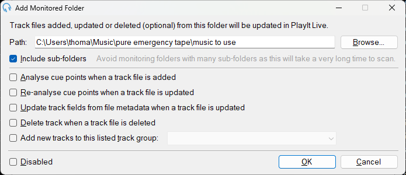

# Add a Monitored Folder to the PlayIt Live Database
A *monitored folder* is a feature of PlayIt Live which will look in a defined folder (and any subfolders of it) and add any music files to it's database. We use this to make adding music easy as we are able to just add content to the `M` drive and the content will automatically be in PlayIt.

## You Will Need
1. A PlayIt Live account with elevated permissions

## Steps
1. Navigate to `Monitored Folders` from within the `Manage` menu in the Menu bar at the top of the main window
2. Click on the `Add New` button in the bottom left hand corner of the `Monitored Folders` window.
3. Within the `Add Monitored Folder` window - use the `Browse` button to launch a File Explorer window which lets you select the folder you wish to add.
4. Check the `Include Sub-Folders` checkbox; this will generate a small warning to pop-up about performance, ignore this.
5. The Finished `Manage Folder` window will look something like this:
 
6. Click `OK`, this will close the `Add Monitored Folder` window
7. Then within the `Monitored Folders` window - click `Apply` then `OK`

Congratulations - You've now added a Monitored Folder. 