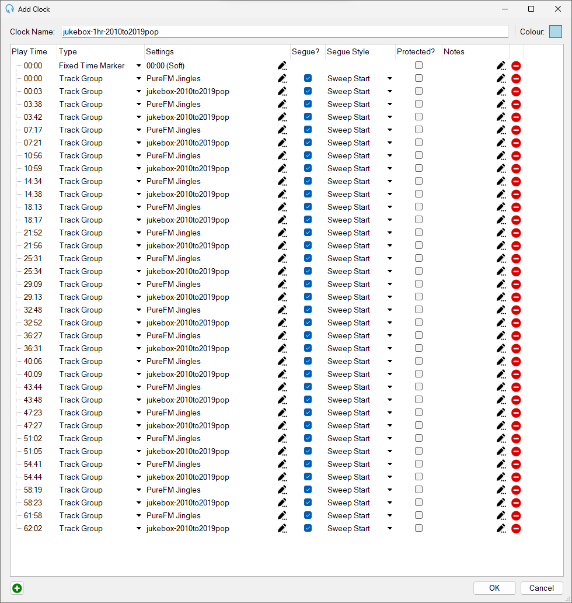

# Creating a Clock

A *Clock* to PlayIt Live is a scheduled hour of content. The content it plays out can be dynamically generated or statically set. What this means for us, is that we are able to setup a one hour block of content, which will play different songs of the set type whenever it is used. This underpins the PureFM Jukebox Content.

## You Will Need
1. A PlayIt Live account with elevated permissions
2. To have already created a Filtered Track Group with the right tracks filtered into it

## Steps
1. Navigate to `Clocks` from within the `Manage` menu in the Menu bar at the top of the main window
2. Select the `Add New` button
3. Give the Clock a suitable name - for example `jukebox-1hr-2010to2019pop`
4. Using the clock editing window - set the first entry to have type `Fixed Time Marker`, then select the pencil in the next cell over and select `Soft` then select OK.
5. Click the plus button in the bottom left of the window which will add a new row. Set this to be of type `Track Group` then set the track group to be `PureFM Jingles - Current` and set the Segue Style to be `Sweep Start`
6. Click the plus button in the bottom left of the window which will add a new row. Set this to be of type `Track Group` then set the track group to be the track group containing the tracks to make this clock up of and set the Segue Style to be `Sweep Start`
7. Repeat the two above steps until the clock is running to just over 60 minutes long. It should look something like the image shown below:

8. Click `OK` which will close the `Add Clock` window then click `Apply` then `OK` to save and close the `Manage Clocks` Window.
Congratulations - You've now created a clock which can be scheduled using the Clock Scheduler.