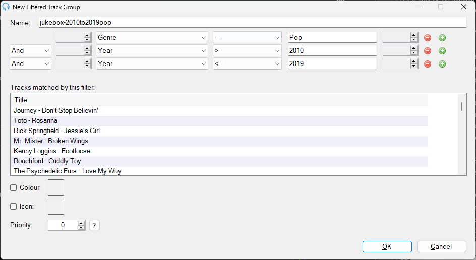

# Creating a Filtered Track Group

We utilise *Filtered Track Groups* to allow easy sorting of music for automated playout.

## You Will Need
1. An account for PlayIt Live which has elevated permissions, which you have logged into

## Steps
1. Navigate to `Track Groups` from within the `Manage` menu in the Menu bar at the top of the main window
2. Click the `Add New` button in the bottom left hand corner of the *Manage Track Groups* window which pops up
3. Select `Filtered Track Group` and press `OK`
4. Enter a suitable name for the track group - for example `jukebox-2010to2019pop`
5. Use the Filter options to select the filtering criteria for the tracks. An example is shown below for setting the filters to filter for Pop from between 2010 and 2019.

6. Press OK
7. The `Manage Track Groups` window will now come back up. Confirm that there are at least *some* tracks in your new group. 
8. If this is a track group which is soley to be used as a Jukebox filter, then check the checkbox in the hidden column. This will prevent the track group from being available to DJs as having lots of them visible will confuse them
9. Press OK which will close the `Manage Track Groups` window

Congratulations - you've successfully created a new Filtered Track Group.