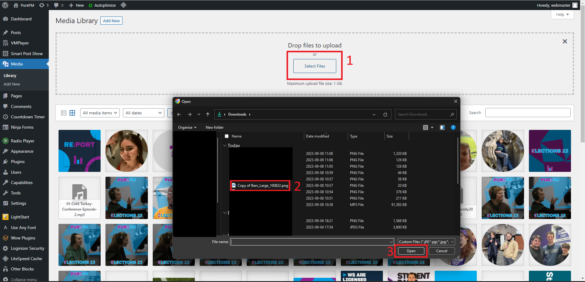

# Creating A Show
This guide will take you through creating a new show on Acast and creating a new post on the website which will display all the episodes published to Acast. This guide has been written working on a Windows PC. Mac and Chrome OS devices should work similarly, however YMMV on mobile devices. 

You will need:
1. The Acast login
2. A login to the website
3. The graphic you will use for the show cover. This needs to be a square image (1000px by 1000px works quite well). Canva is a good tool to use to create this and there are lots of templates which you can just adapt. 

## Part 2: Creating the show on Acast
1. Go to Acast ([`acast.com`](https://www.acast.com))
2. Click "Log In" in the top right hand corner. When prompted, enter the Acast login details.
3. When you get to Acast's "My shows" page - click "New show"

4. Select "I want to create a new show"

5. Fill out the *Title*, *Summary*, select the cover image and add at least one category. Then scroll down and click "Create my new show"

6. Once Acast has created the show, it will redirect you to the new show's homepage

That's all we need Acast for now, however don't close the tab or log out as we'll need to grab a widget in a little bit.

## Part 2: Adding the Show to The Website
1. Go to [`thisispurefm.com/wp-login.php`](https://thisispurefm.com/wp-login.php) and login
2. From the WordPress admin menu, click on "Media" which is on the left hand side and should be quite near the top.

{: .information}
Depending on what account you are using - your menu will look different to the one shown as I'm using a Site Admin login

3. Within the media library screen, click "Add New" at the top

4. Then click "Select Files" then select the cover image of the news show

5. Once it's been uploaded, it will be shown in the media library

6. Now click "Posts" in the left hand menu, this will probably be a bit higher up than "Media"

7. Click the "Add New" button at the top of the screen

8. This will take you to the post editor. First, delete "Auto Draft" and enter the name of the show in the title area.

9. Type `/pattern` where it says "Type / to choose a block" and select "Show Template"

10.  The click the "Detach Pattern" button

11.  Now add the Show Title where the text says "Show Title" and the introduction to the show (this should be the same as used on Acast).

12.  Then scroll down on the right hand menu until you find the "Featured Image" option. You may need to expand it using the little arrow. Once opened - click the "Set Featured Image" button.

13.  This will being up the media library. Select the cover image you uploaded earlier (should be the top-leftmost image). Once you've selected it, click "Set featured image" in the bottom right hand corner.

14.  This will then set both the cover image for the post and the background image for the page. Next find the Categories option on the right hand menu and tick "Radio Shows". If any other categories auto-set themselves, ensure they are unchecked as this will mess up indexing on the website!

## Part 3: Embedding The Acast Widget In The Website
1. To embed the Acast widget ni our website, we first need to go back to Acast's shows page for our new show and click the "Embed Player" button.

2. Once the menu has opened, the only thing you need to change is player size - set that to `Medium (5 episodes)`. Then click on "Copy Embed Code". The player preview will show an error as we haven't added any episodes to the show on Acast yet, this is fine and will fix itself once we've added an episode.

3. Now return to the WordPress editor page and paste the Acast embed code into the box which should say `Acast embed` in it.

4. Finally, change the "Status" of the post to "Publicly Published" then click "Update"

5. If you're presented with a menu which offers to save the Show Template as well as the page, make sure to un check the box (you may not get this option and it may just post automatically for you.) Then click "Save" at the top. 

6. The post should now be live! You will know this from a notification come up in the bottom left of the screen as seen below. You can open the post by pressing the open icon nex to the "Update / Publish" button.

7. Check the post is live and looks alright by either going to the Radio Shows section on the website or clicking on any of the options in Step 7.

Congratulations! That's the show created in WordPress and Acast, now it's ready to have episodes added to it!

## Part 4: 

{: .warning}
> These steps can only be completed once at least one episode has been added to the show.
>
> Always consult Station Management before changing any of these settings as they control content distribution and **will** effect listeners.

1. Go to the show's homepage on Acast and click on "Distribution"
2. Then under the Automatic Submission category, select the Activate button next to Spotify then agree to te popup. 
3. Also from under the Automatic Submission category, activate Amazon Music and Deezer (these will both have different popups - agree to them) 

All of the above distribution methods may take some amount of time to properly configure as each platform has to review and approve them.