# Publishing An Episode

This guide will take you through adding an episode to a show which has already been created on Acast then adding that show to our website by creating a news Post. This guide has been written working on a Windows PC. Mac and Chrome OS devices should work similarly, however YMMV on mobile devices.

You will need: 
1. The Acast Login
2. A login to the website

## Part 1: Uploading the show to Acast
1. Go to Acast ([`acast.com`](https://www.acast.com))
2. Click "Log In" in the top right hand corner. When prompted, enter the Acast login details.
3. Once the list of shows load, click on the show which you ware uploading the episode of. if this show doesn't appear then you will need to create it first ([Creating A Show guide](creating-a-show.html))
4. From the show homepage, click the "New Episode" button
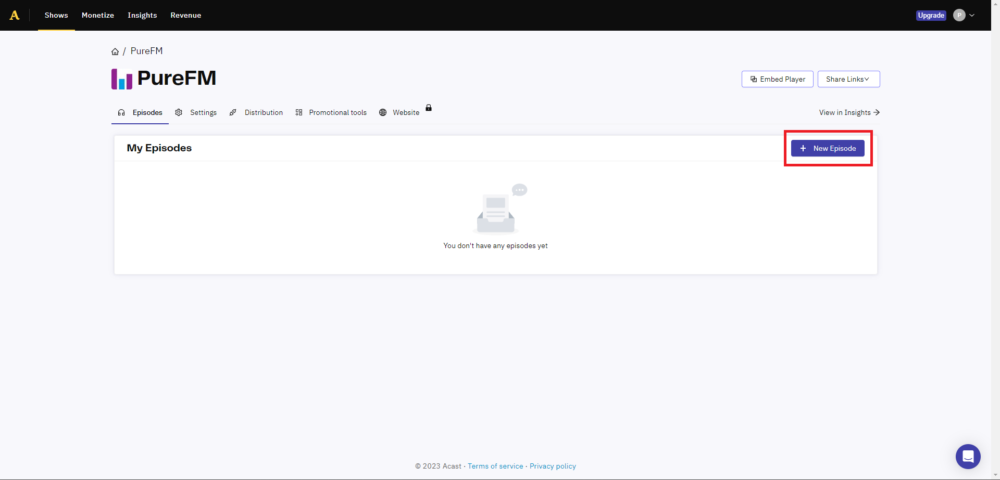
5. In the new Episode Details screen, select "Upload audio file" then select the audio file. Then enter the Episode title and if relevant - enter the Season and Episode number. The other fields are optional, including uploading a custom episode cover image (if you don't do this then it will default to the show cover image which is what we normally want it to do). When you have finished, press the "Next: Publish Settings ->" button.
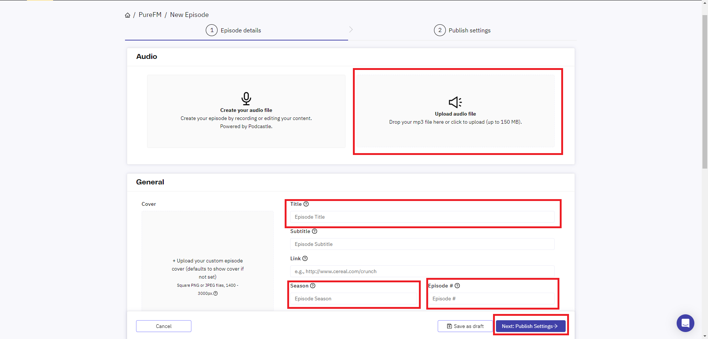
6. On the Publish settings window, you have the option to change when the episode will be published (past, present and future). Once you're happy with the publish date, click "Publish"
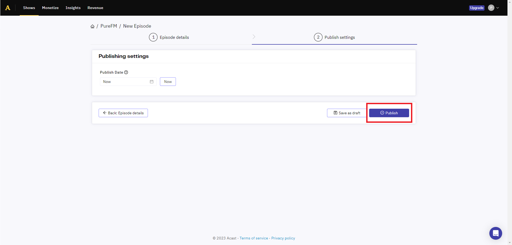

That's all we need Acast for now, however don't close the tab or log out as we'll need to grab a widget in a little bit.

## Part 2: Adding the episode to our website
1. Go to [`thisispurefm.com/wp-login.php`](https://thisispurefm.com/wp-login.php) and login
2. From the WordPress admin menu, click on "Posts" which is on the left hand side and should be quite near the top.

{: .information}
Depending on what account you are using - your menu will look different to the one shown as I'm using a Site Admin login

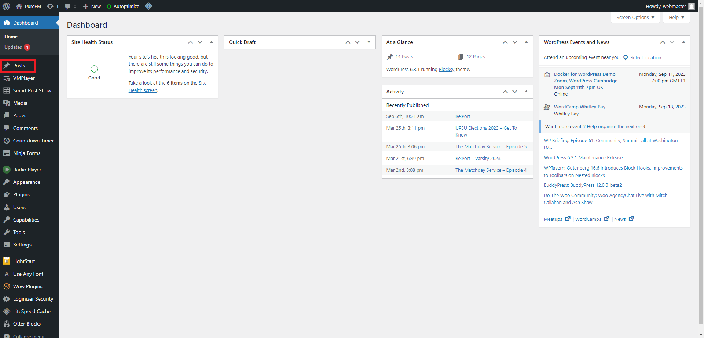
3. Then select "Add New"
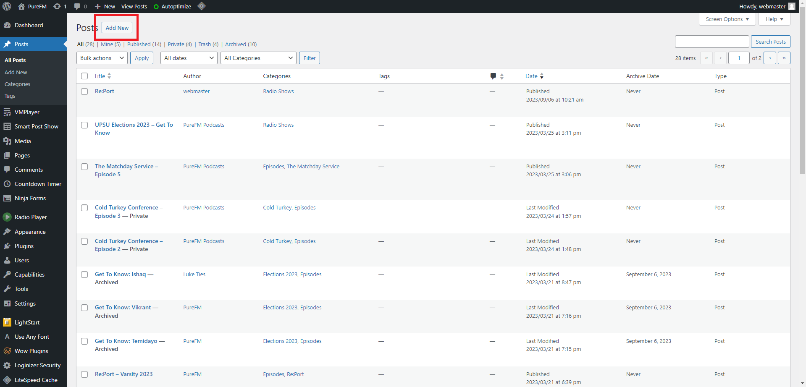
4. Once the post editor has loaded, delete the auto generated title (`Auto Draft`) and enter your episodes title. This should be in the format "Show Name - Episode Name / Episode Number" unless it's a one-off in which case it should just be called the Episode's name.

5. In the main editor section (where it says "Type / to choose a block"), type `/pattern` and select "Episode Template"
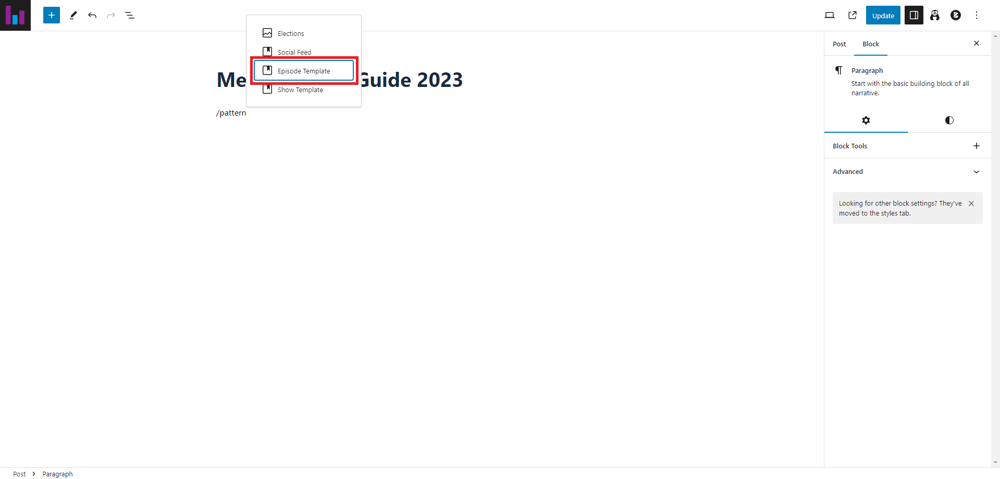
6. Once the pattern has been inserted (it'll have a glowing purple border), select it and press the "Detach Pattern" button.
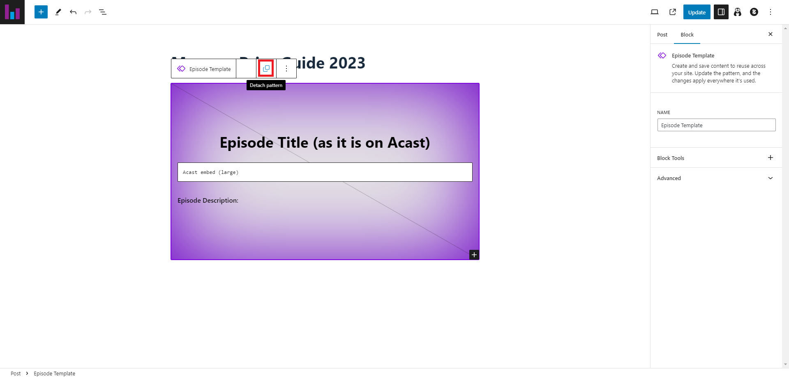
7. Replace "Episode Title (as it is on Acast)" with the title of the episode and enter the episode description after the colon after "Episode Description".
8. In the menu on the right hand side, scroll down to "Featured Image" and click on the "Set Featured Image" button.
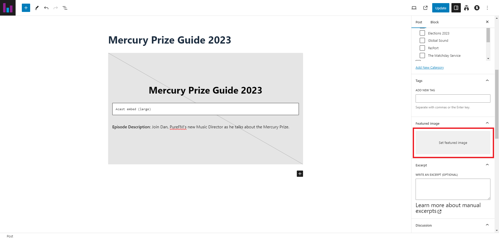
9. Then in the media library selector - find the cover image of the show whose episode you are uploading. If it's not there - upload it.
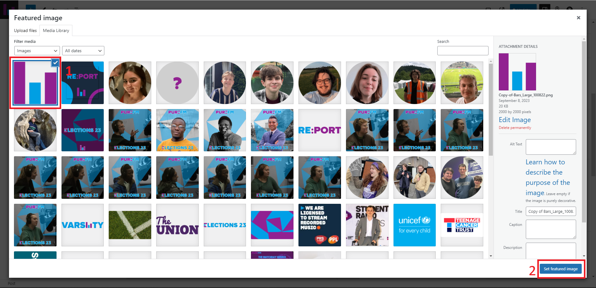
10. In the menu on the right hand side, locate the "Categories" section. Select both "Episodes" and the sub-category of Episodes which is the name of the show; unless this episode is a one-off in which case - just select Episodes. (The episode I'm demoing on is a one-off).
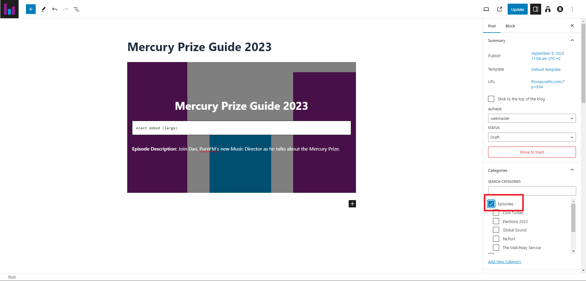
11. Int he menu on the right hand side, change the "Status" of the post to "Publicly Published" then click "Update" in the top right hand corner.

The post is now live, however we need to add the Acast widget to the page so listeners can actually listen to the content!

## Part 3: Embedding the Acast Widget on the Episode's Page
1. Go back to Acast and select the episode from the list of episodes from the show
2. Click "Embed Player" to bring up the embed player dialogue box
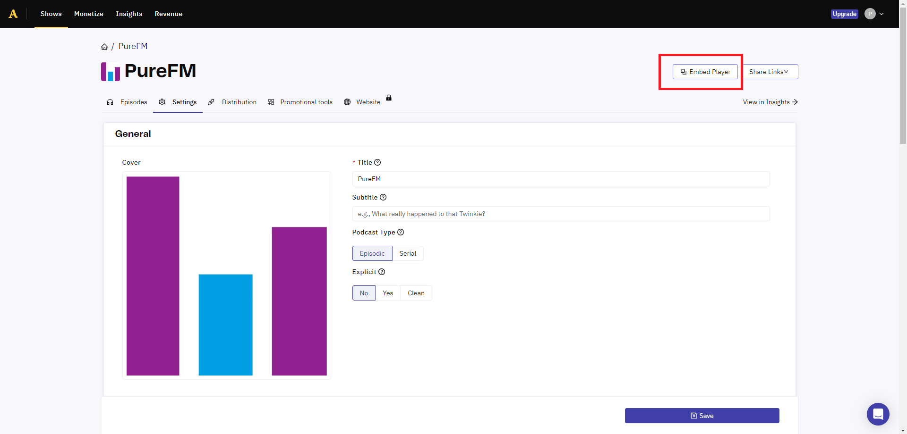
3. The settings it gives by default are the ones we want to use, ensuring that the size is set to Large. Then click "Copy Embed Code"
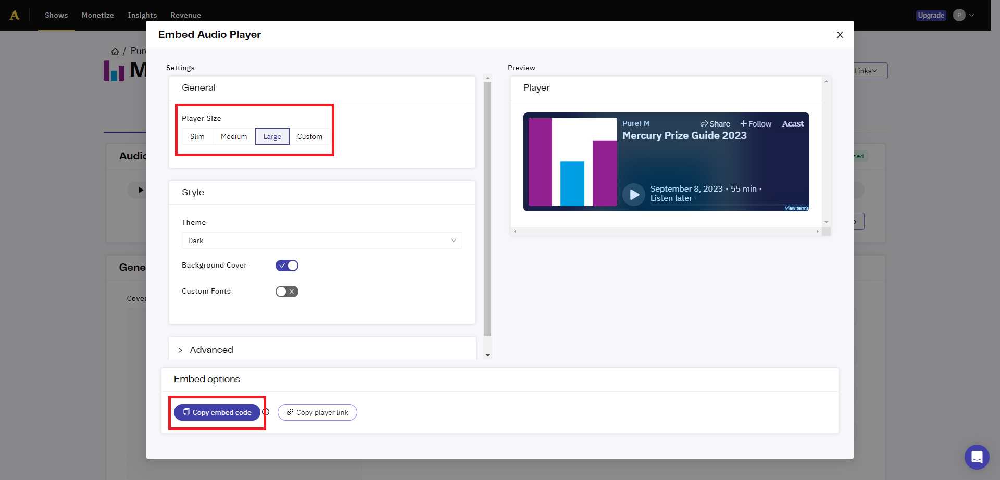
4. Now return to the WordPress editor and paste the embed code into the white box which says "Acast embed (large)", deleting this text from it in the process
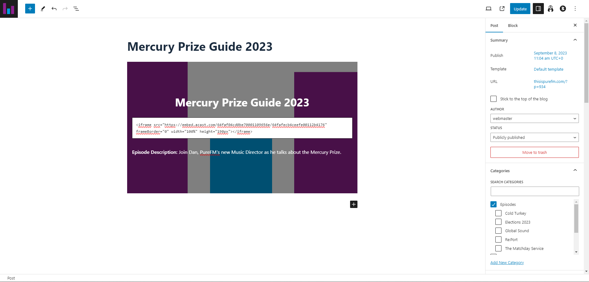
5. Finally, press the "Update" button in the top right hand corner of the WordPress page. Then go to the website and check that the post is live and it looks right! It should be listed on the scroller on the homepage and under episodes.
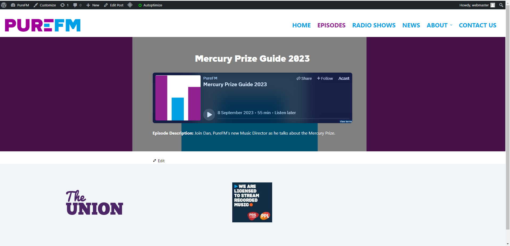

And just like that, you've published an episode of a show to the website!