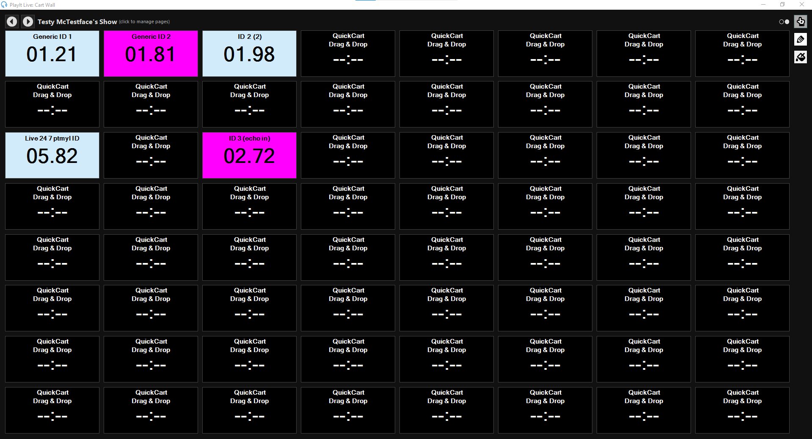
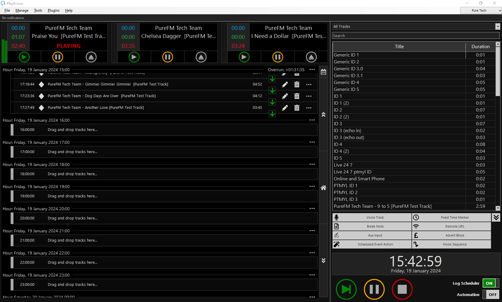
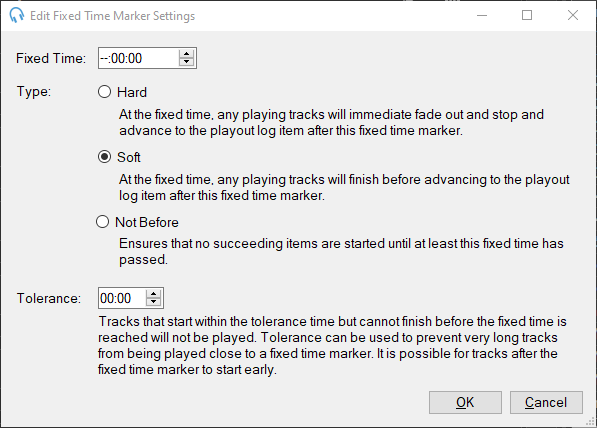
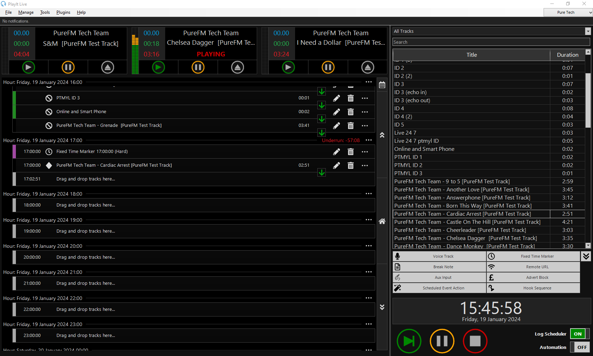
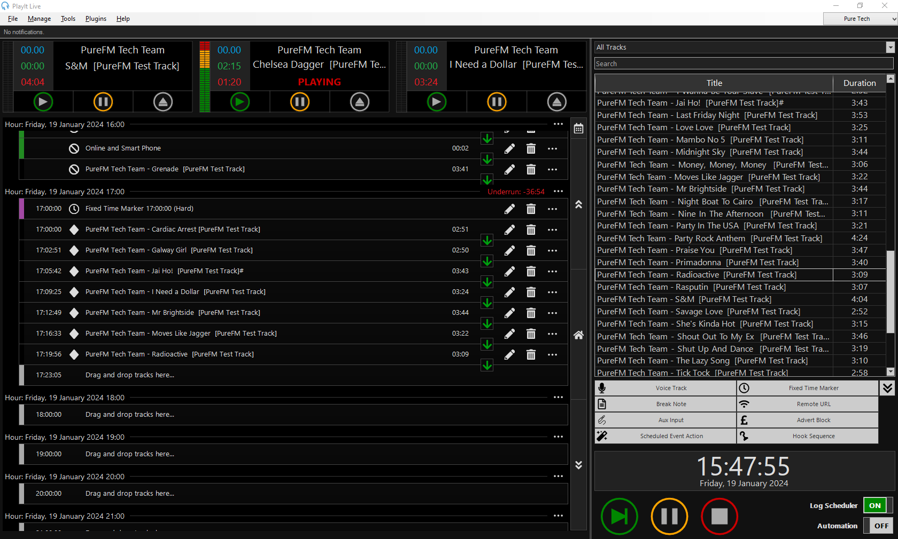

# Running Studio 1 for a Live-To-Air Episode
This guide will take you through the basics of how to operate Studio 1 for a Live-To-Air broadcast.

You should take time to read through this guide before your first live show, ensuring you ask any questions you may have in your training session.

## You Will Need
- A committee member to allow you access to the studio
- Your Playlist, ready to setup on PlayIt Live

## Part 1: Entering the Studio and Setting Up
1. When you arrive at the studio, do not enter until the Committee member allows you to do so; this is to ensure that the studio is clear for entry.
2. Once you've entered the studio, sign in using the sign in sheet then switch on the "Mic Live" light - this light switch is below the normal light switch
3. If you feel so inclined - turn on the aesthetic lighting, using the plugs labelled as so. If you don't feel that way - make sure you turn on the normal lights in the studio.
4. Turn on the green labelled plug behind the presenter's chair. This will turn on the audio monitors.
5. Turn on the the green labelled plug to the left of the presenter's position - this will turn on the visual monitors
6. Login to the `PURE-S1-02` with *your* PureFM Credentials
7. Login to PlayIt Live using *your* PlayIt Live credentials. If the PC requires a password - speak to your supervising Committee member. 

## Part 2: Setting Up PlayIt For Your Show
1. On the *Quick Cart Wall* (on the right hand monitor), cycle through the pages using the arrows in the top left corner until you find yours. This will take a moment to load, then it should show you Quick Carts.

2. Scroll on the *Playout Log* to find your show's hour. This should be directly below where it is currently. If the software has decided to load any content into this hour - speak to your supervising committee member.
3. Look at the Special Items Palette

4. Click and drag a `Fixed Time Marker` to your show's hour. This will need to be at the Top of The Hour to ensure that and automated blocks playing out before your show - don't run over too much. Select a Soft Time Marker and add that.

5. Using the Track search options, find the first song in your show. Drag into the playout log, drop it **below** the fixed time marker.

6. If you have time - keep adding more tracks to your show. If you don't, start your show then add more tracks while the first one is playing.

## That's where this guide stops...
But not where the documentation stops - to keep things simple, we've broken documentation down into a series of sub-pages so you can find the resources you need quicker!

## Part x: Wrapping Up Your Show
Continue from here in this guide once you've finished your show.

1. When you have finished your show, ensure that the playout log on PlayIt Live is set to run to the end of your show's time block with music. It will not automatically add more music to fill the gap if you leave one. Also ensure that the tracks are set to auto advance.
2. Using the User options in the top right hand corner (click on your name), log out
3. Log out of `PURE-S1-02`
4. Turn down all Monitoring Outputs on the Sound Desk
5. Turn off the green labelled plug to the left of and behind the presenter's chair
6. Fill out the sign out sheet by the door
7. Turn off all lighting (including the Mic Live light)
8. Leave.