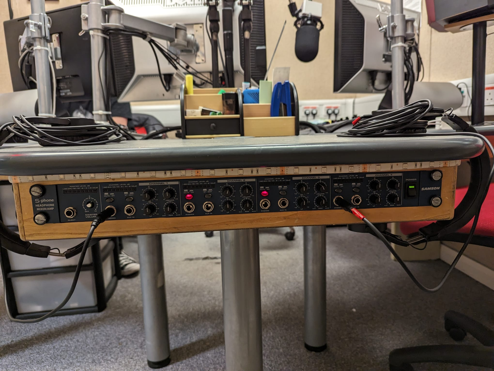
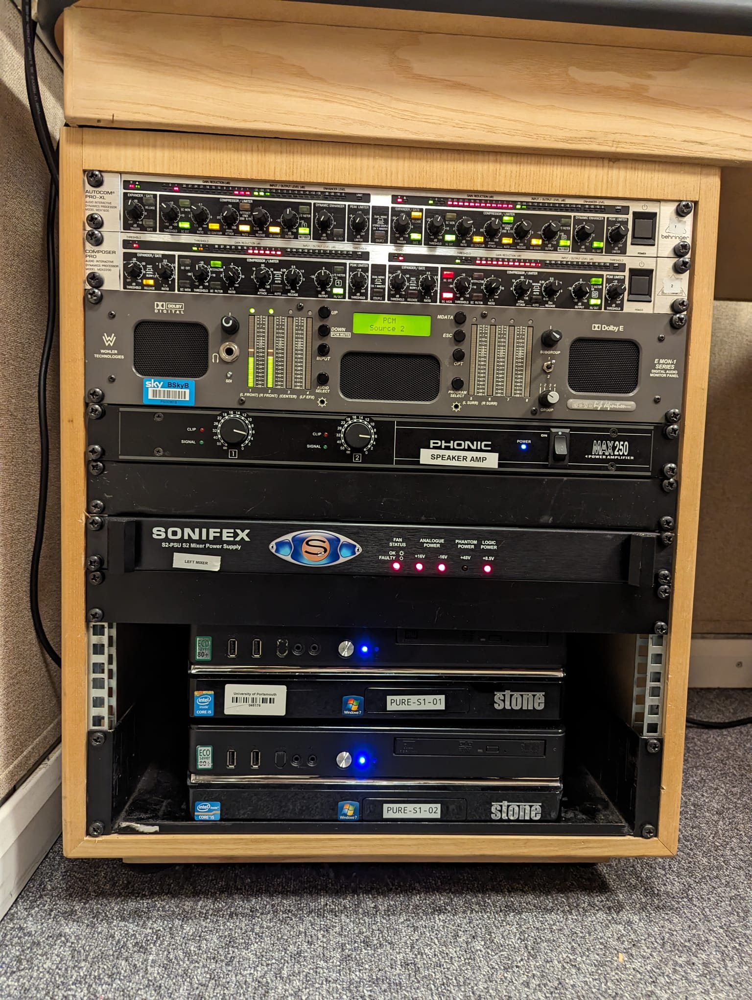

# Miscellaneous Audio Things In Studio 1

To make PureFM do the Radio things - there's actually quite a lot of miscellaneous technological gubbins which we have to keep around. This page will talk you though some of said gubbins and how it works. Note - not all of it is included here as to not scare non-tech people too much.

## Headphone Amplifier
We utilise a Headphone Amplifier on the Guest & Co-Presenter side of the desk; this enables us to plug multiple headphones into one output from the desk. It has some configuration options on it, these can be seen in the below photo - generally the options should be left as they are in the below photo.

## The Rack
In the corner of Studio 1 - by the Presenter's Chair, there is a small rack. This houses some critical hardware to both the operations of Studio 1 and to the wider stations functioning. The only thing you should ever need to touch within the rack is the two computers at the bottom. These are the two studio computers - `PURE-S1-01` and `PURE-S1-02`. If either are turned off when you need to use them, use the silver power button on the front of them to turn them on. Under absolutely no circumstances should you be touching anything else in the rack. Some of the components in this rack are core parts of the TX chain and therefore the only person authorised to operate them is the Technical Director.
