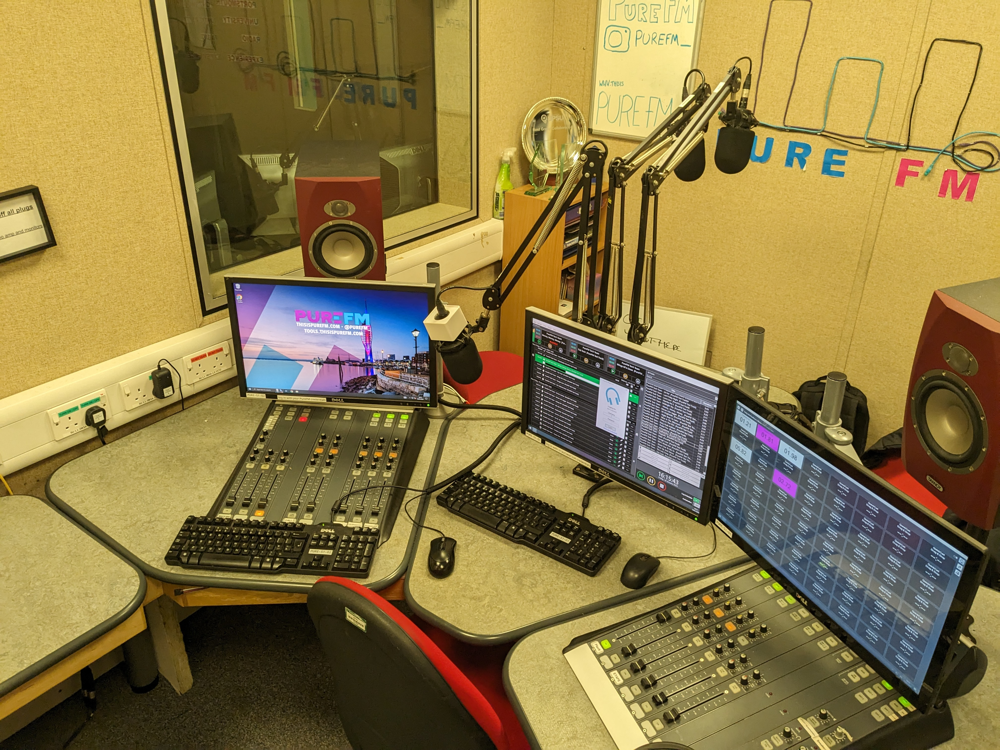
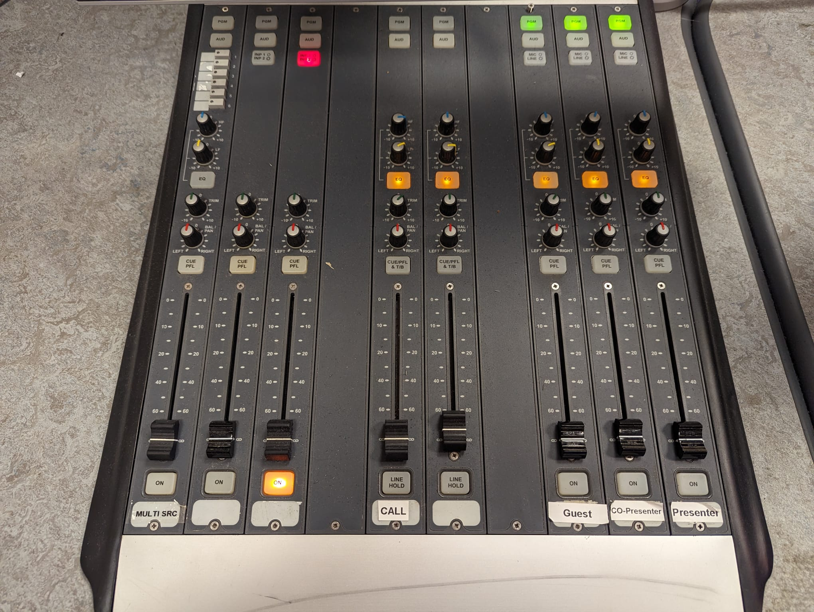
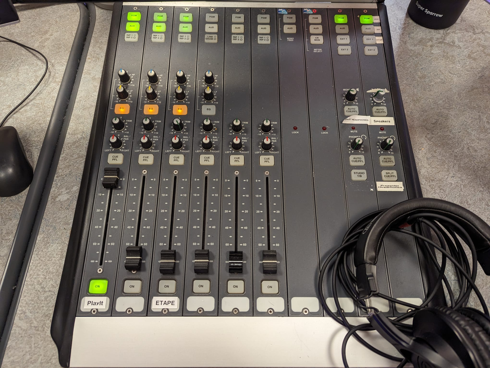
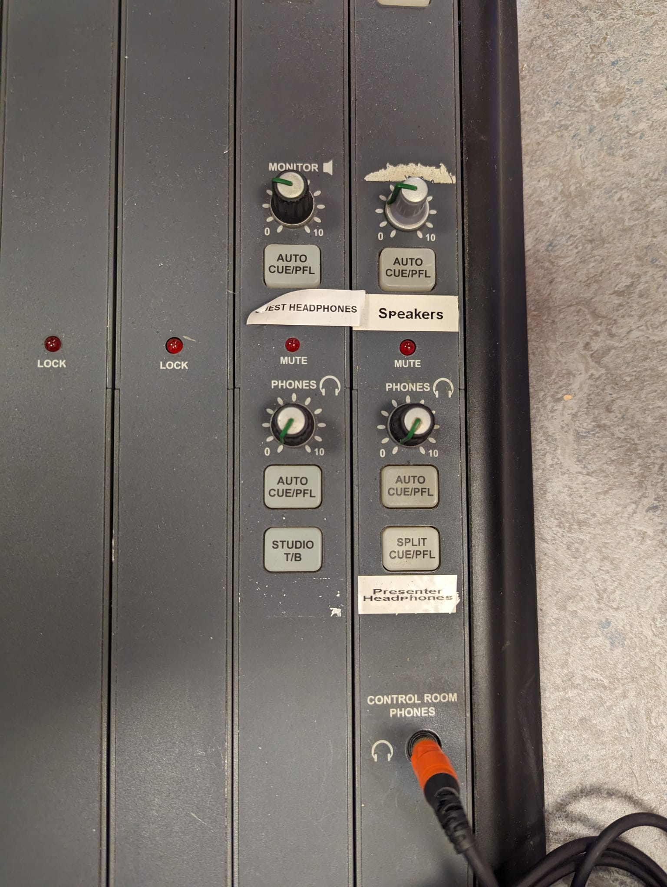

# The Studio 1 Sound Desk

The Studio 1 Sound Desk is split into 2 parts - a left portion and a right portion. This is common amongst radio studios as it allows for a more ergonomic setup.

Despite the desk looking a bit strange - it behaves much the same as a standard sound desk, with some channels having EQ, Pan and Trim (a bit like Gain). Generally speaking - these should be left as neutral as possible (this means pointing to 12-O'Clock), apart from one which we'll talk about below.

## How A Sound Desk Works
A sound desk works by having an individual "channel" which is connected to one input. Each channel has a set of independent controls which can be done to it - allowing it's sound to be fine tuned. The Studio 1 sound desk does not have a master output - this means if a channel is open (the fader is up) and turned on, then it wil be going live to broadcast. You have been warned. 

"turned on", what does this mean? Yes - the channels can be turned on and turned off. This is controlled by the button below the fader. Think of it like a mute button - "turned on" (the light is turned on) means the channel is unmuted and "turned off" (the light is turned off) means the channel is muted and regardless of where the fader is - sound will not come through.

Another wondrous feature our sound desk comes with is denoted by "CUE PFL". These little buttons above the fader allows the presenter to listen to something before opening it to the broadcast, this is called a "Pre Fade Listen". Do not touch this as it gets confusing. The buttons should not be illuminated, if they are - press them to disable it.

## Left Desk

The left hand side of the sound desk is currently used for microphone channels - these are the three right-most channels on the desk, labelled from right to left for the presenter microphone, the co-presenter microphone and on the left is the guest microphone. 

The other channels on the left hand side of the desk are unused. They are not connected to anything however some of them light up strangely - ignore this. We are working on getting them to not light up.

## Right Desk

The right hand side of the sound desk is used for stereo audio inputs - this currently is PlayIt Live and the Emergency Tape. In the future - a input from Studio 2 will be added.

{: .new}
The issue with the Emergency Tape volume has been fixed. Do not turn the *Trim* knob beyond 12 O'Clock. 

On the far right hand side of the desk, the final two strips, are used for monitor outputs - these four knobs, as seen below, control different monitoring outputs from the desk.

The top left knob is the feed which runs to the Headphone Amplifier used for the Co-Presenter and Guest Headphones; the top right knob controls the monitor speakers in the studio; and the bottom right knob controls the presenter headphones. Use these knobs to control how much sound you want the relevant device to make. Generally speaking - none of the knobs should be turned up more than 9-O'Clock. Note that when a microphone channel is open, the speakers will automatically cut out - this is to ensure that there is no audio leak from the microphone into the speakers which will cause feedback. 