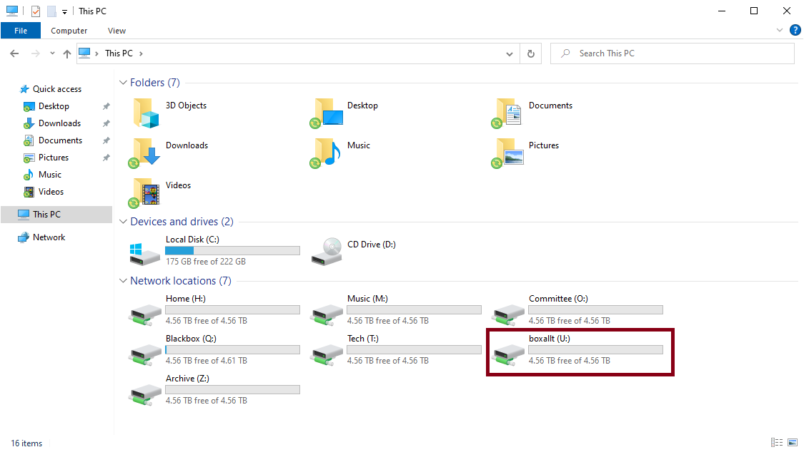
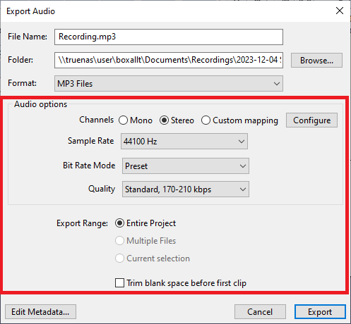
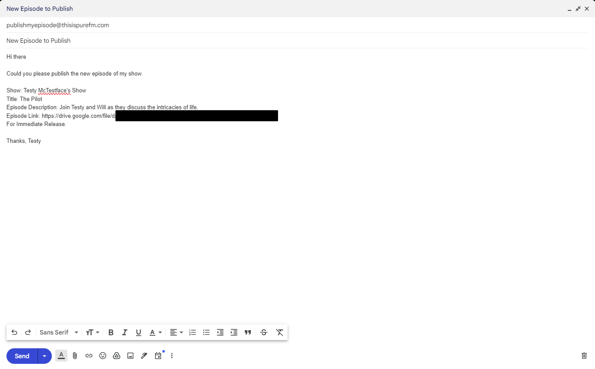

# Recording an Episode

A guide on how to record an episode using the equipment in Studio 2

## Before You Start

- Make sure you read this guide in it's entirety before starting!
- Make sure you have an account for use with our computer systems
- Ensure a member of committee has approved your use of Studio 2

## Part 1: Setup and Preperation

1. When entering the studio, make sure you fill out the sign in form, attached to the wall to the right of the door
2. Turn on the monitor, using the plug shown below  

3. Log in to the computer with your PureFM credentials
4. Open file explorer and open your `U:\` drive, the name of it should be the same as your username.

5. Within your `U` drive, open the Documents folder and make a folder in there called `Recordings`, if it doesn't already exist.

1. Within your Recordings folder, create another folder with the show title, episode number and date -  for example: `My Show - Ep1 - 2023-12-05`. 

1. Position the microphones so they are roughly a closed fists length away from your mouth and in a comfortable position for you to sit
2. Move the `PRES` (Presenter Microphone), `GUES` (Guest Microphone) and `MAIN` faders on the desk so they are within the shaded range, next to the U, as shown below  

1. Put the headphones on, and speak into the microphone. If the `MAIN METERS` LEDs reach into the yellow or red range, move the presenter fader down slightly. Repeat this process with the guest microphone and fader

{: .note}
If the volume of the live monitor in the headphones is too loud, reduce the volume of the `PHONES` dial, **not** the microphone faders

## Part 2: Recording using Audacity

1. Open Audacity using the shortcut on the desktop  

2. Within Audacity's Audio Setup menu, ensure that the Playback Device is set to "Speakers (USB Audio CODEC)" and the Recording Device is set to "Microphone (USB Audio CODEC)", as shown below  
  
  

3. You are now ready to record an episode!
4. You can start recording either by pressing the red cicrular button in Audacity, or by pressing `R` on the keyboard
5. To stop recording when you're finished, either press the square stop button in Audacity, or the spacebar on the keyboard
6. Save your episode! In the File menu in Audacity, press the Save Project button within the Save Project menu, and then save the file with the name `Recording`, within the episode folder you created earlier
7. If a popup appears about exporting audio, you can safely ignore it and continue

{: .note}
This is not the final audio which you will be editing! Please follow the next part to make sure that your episode has that *classic radio sound*

## Part 3: Getting that *Classic Radio Sound*

1. Select the entire track of audio using `CTRL-A`
2. In the "Effect" menu, within "EQ and Filters", open the "Filter Curve EQ" window
3. At the vertical line marked 100Hz, click to add a point to the EQ curve. Then click again at the vertical line to the left of 100Hz, and drag this new point up to +6dB
4. Half way between the vertical line marked 2000Hz and the line to it's right, click to add a new point. Then click again on the line to the right of 2000Hz and drag this new point up to +6dB. It should now appear as in the image below  

5. Click the "Apply" button in the top-right corner
6. Make sure all of the audio is still selected, if not, use `CTRL-A` again
7. In the "Effect" menu, within "Volume and Compression", open the "Amplify" window
8. Leave all the settings at the defaults and click "Apply" button in the top-right corner (The settings may look different to the picture below, as Audacity automatically normalises the audio levels)  

9. Make sure all of the audio is still selected, if not, use `CTRL-A` again
10. In the "Effect" menu, within "Volume and Compression", open the "Compressor" window
11. Set the "Threshold" slider to -30dB, set the "Noise Floor" slider to -50dB, set the "Ratio" slider to 5:1, and set the "Attack Time" and "Release Time" sliders to the lowest possible value  

12. Click the "Apply" button in the top-right corner
13. Make sure all of the audio is still selected, if not, use `CTRL-A` again
14. In the "Effect" menu, within "Volume and Compression", open the "Amplify" window once again
15. Set the "New Peak Amplitude (dB)" value to -3dB, but leave all other settings at the defaults  

16. Click the "Apply" button in the top-right corner
17. Cut out noise at the start and end of the audio, since these will contain the sound of a mouse or keyboard press to start and end the recording
18. Save your episode!
19. Perform any other editing work you need to do, such as adding background music or sound effects
20. Save your episode again, but this time with the filename `Recording-Edited` so that the original audio is still available, should it be needed

{: .note}
The files you've saved so far should be in the `.aup3` format, which can only be read by Audacity. To get the final audio to be published, you need to export the file as an `.mp3`

## Part 4: Getting Your Episode Published

1. In the "File" menu in Audacity, open the "Export Audio" window  

2. Set the Folder to the episode folder you created earlier
3. Change the file name to whatever you want, as long as it ends with `.mp3`. The filepath to the folder will look a little strange, as long as it starts with `\\truenas\user\YOUR_USER_NAME\` you'll be fine  

4. Make sure the other settings match the image below, and then press the "Export" button in the bottom-right  

5. Check the folder to make sure the file exported successfully, and give it a listen to make sure it sounds alright
6. Upload the file to your University of Portsmouth Google Drive
7. Set the sharing options for the file to "Anyone with the link", and copy the link to the file  

8. Send an email to [publishmyepisode@thisispurefm.com](mailto:publishmyepisode@thisispurefm.com) with the subject "New Episode to Publish" and the body containing the details of the episode, as shown below  

9. Once the email has been sent: 
  - Close all open programs, and **sign out** of the computer
  - Turn off the monitor at the wall
  - Push the microphone back out the way
  - Push the 3 faders back down to the bottom