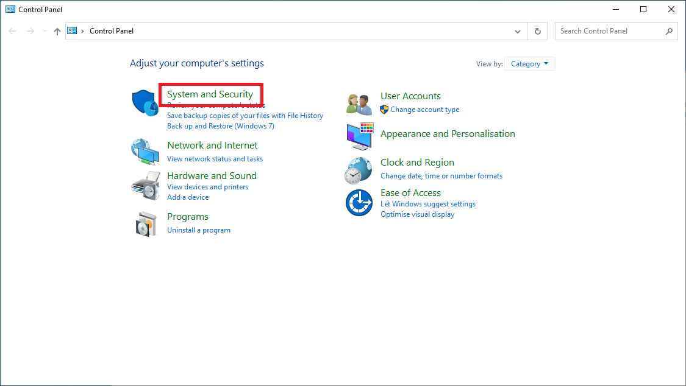
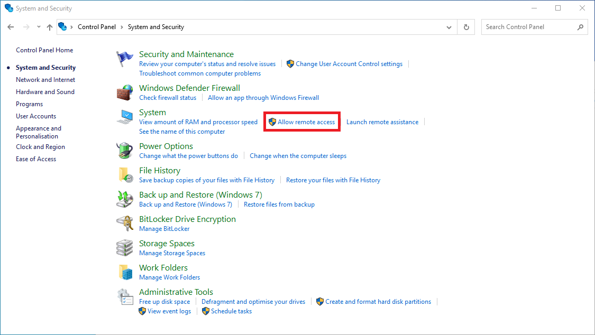
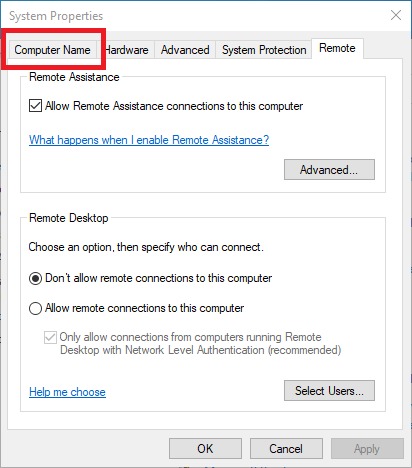
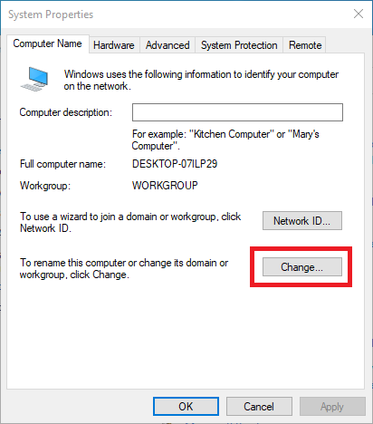
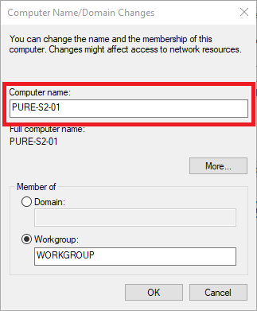
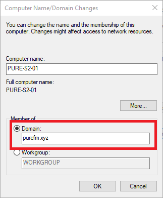

# Domain Joining a PC

This guide can continue directly on from the [Installing Windows 10 Guide](../windows/installing-windows-10)

{: .note}
Check once again that the computer is connected to the PureNET network before proceeding

1. Open the old-school Control Panel by searching for it in the Start Menu
2. Click on the "System and Security" section  

1. Under the "System" heading, click on "Allow remote access"  

1. In the "System Properties" window, move to the "Computer Name" tab  

1. Click on the "Change" button  

1. Change the "Computer Name" field to one of the following: For a studio PC, give it the name `PURE-SX-YY` where X is the studio and YY is the number of the computer, with a leading zero. For an OB PC, give it the name `PURE-OB-XX` where XX is the number of the computer with a leading zero  

1. Change from "Member of Workgroup" to "Member of Domain", and in the Domain box, put `purefm.xyz`  

1. When prompted for a username and password, enter either your Domain Super Admin account, or contact the Technical Director for assistance
2. Once authenticated, it may take a second to join the domain, and then a window saying "Welcome to the purefm.xyz domain"  

1.  Click "OK" on this window and reboot the computer

{: .note}
The computer should now be fully setup and connected to the domain. When the computer has restarted, try logging in with your account. It may take a while for the first log in. If it doesn't work, contact the Technical Director