# Installing Windows 10 & Domain Joining a PC

We are sticking with Windows 10 for the time being, as it has all of the features of Windows 11 but with lower hardware requirements and better stability.

## Requirements

To install Windows 10, you will need:
- A Windows **10** installer USB (This can be created using the [Windows Media Creation Tool](https://www.microsoft.com/en-us/software-download/windows10) or [Ventoy](https://www.ventoy.net))
- A computer to install to
- A network connection for the computer

{: .warning}
Please make sure that you select the English International version, as this comes with the UK language pack!

## Part 1: Installing Windows 10

1. Boot the computer from the Windows 10 installer USB. This can be done by using the boot menu of the computer, which is accessed by pressing or holding one of the following keys at startup: F2, F8, F12 or Delete. If you enter the BIOS or boot normally, please turn of the computer and try a different key. The USB stick will usually be displayed with the brand or model name of the USB stick
2. When booted into the Windows setup screen, make sure that the "Language to install" and "Time and currency format" are set to `English (United Kingdom)`, and that the "Keyboard or input method" is set to `UK` or `GB`  
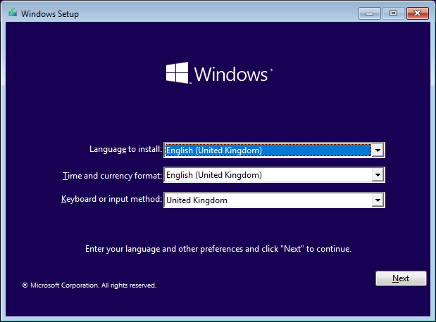
3. Press the "Install Now" button  
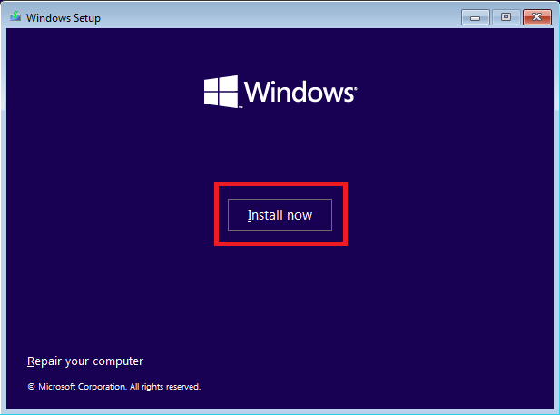
4. When prompted for an activation or product key, press the "I don't have a product key" button in the bottom right. All of PureFM's computers are using digital licenses and so will activate automatically when connected to the internet  
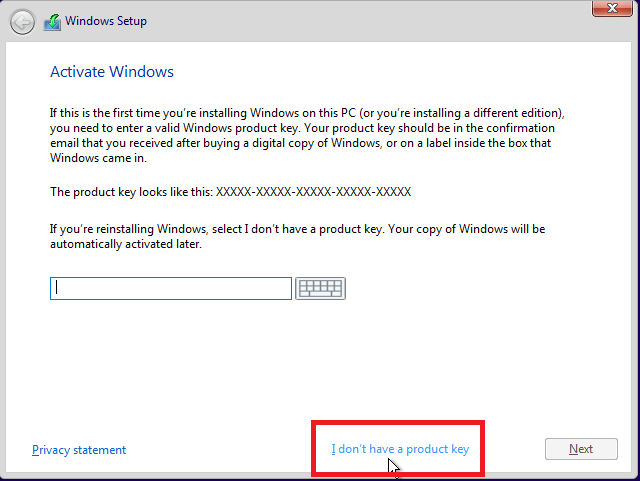
5. Select Windows 10 Pro from the list of versions, then press Next  
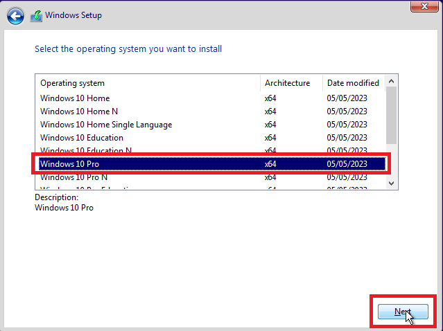
6. Check the box in the bottom left to accept the license terms, then press Next  
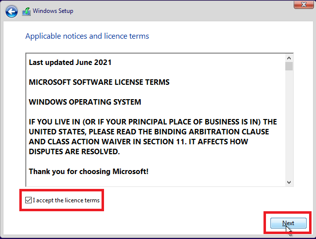
7. Select "Custom: Install Windows only (advanced)"  
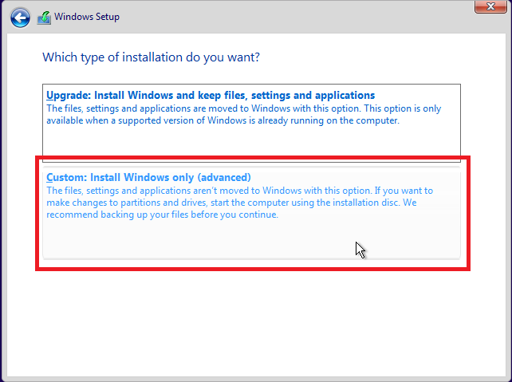
8. If the drive already has data on it, check with the Technical Director before continuing. If permission is given, select each partition and delete it
9. Select "Drive x Unallocated Space" and click Next. If prompted about Windows creating more partitions automatically, click Okay  
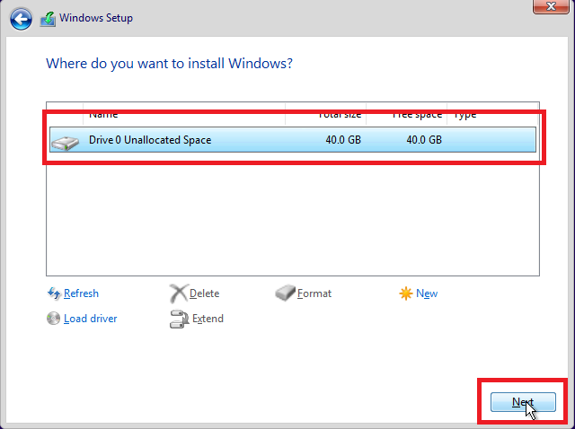
10. Wait for the installation to complete, then reboot the computer and remove the Windows installer USB

{: .note}
If everything was successful, the computer should reboot automatically, and place you into the OOBE (Out Of Box Experience). Move on to Part 2: Configuring Windows 10

## Part 2: Configuring Windows 10

{: .note}
Please ensure the computer is connected to the PureNET network before proceeding

Once the computer restarts, it's time to configure Windows and setup the puretech account
1. Select "United Kingdom" for the region, then press yes
2. Select "United Kingdom" for the keyboard layout, then press yes
3. Press skip when prompted to add a second keyboard layout
4. Wait for Windows to connect to the internet and perform updates
5. Select "Set up for an organisation" and click next
6. Click the "Domain Join Instead" button in the bottom left  
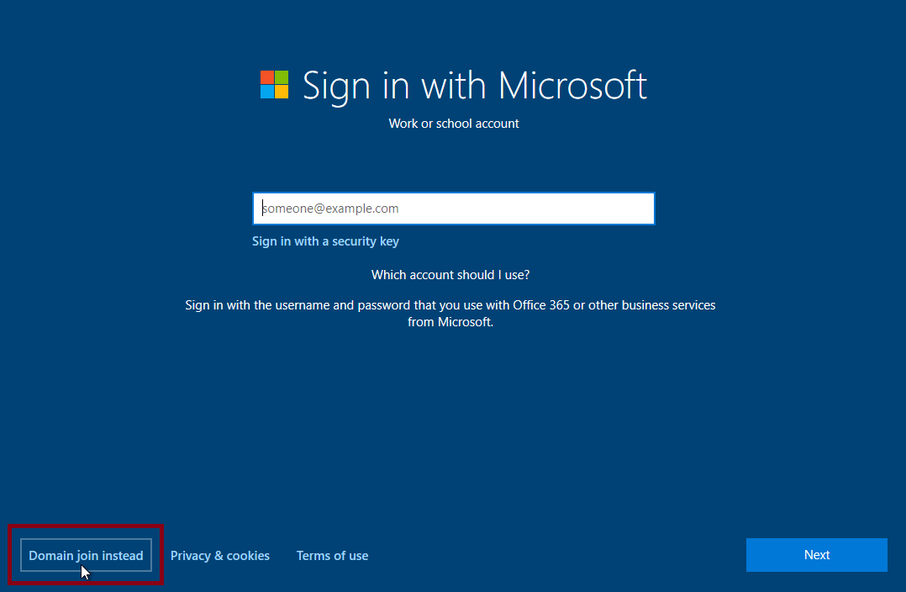
7. When prompted for a username, enter `puretech` then press next
8. Enter the password from the password manager
9. When asked for security questions, select "What was your first pet's name?", "What is the name of the city where you were born?", and "What was your childhood nickname?" and for each question, enter a random value. Make sure to write it down and give it to the Techincal Director
10. If prompted to "Import your data from your other browser", press "Not Now"
11. For each of the "Services", select "No" and press "Accept"
12. On the "Let's customise your experience" page, press "Skip"
13. If prompted to "Let Cortana help you get things done", press "Not Now"

{: .note}
If everything was successful, Windows should take a few minutes to "Get everything ready for you" before dropping you to the desktop. You can now move on to Part 3: Joining Active Directory

## Part 3: Joining Active Directory

{: .note}
Check once again that the computer is connected to the PureNET network before proceeding

1. Open the old-school Control Panel by searching for it in the Start Menu
2. Click on the "System and Security" section  
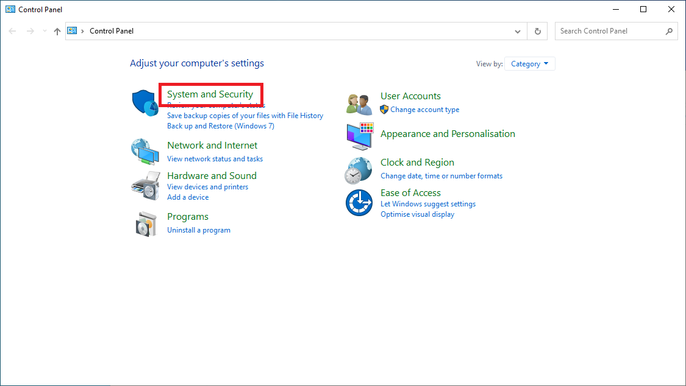
3. Under the "System" heading, click on "Allow remote access"  

4. In the "System Properties" window, move to the "Computer Name" tab  

5. Click on the "Change" button  
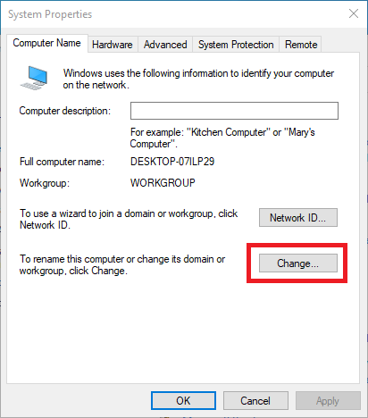
6. Change the "Computer Name" field to one of the following: For a studio PC, give it the name `PURE-SX-YY` where X is the studio and YY is the number of the computer, with a leading zero. For an OB PC, give it the name `PURE-OB-XX` where XX is the number of the computer with a leading zero  
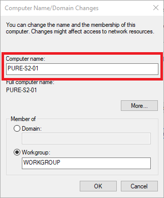
7. Change from "Member of Workgroup" to "Member of Domain", and in the Domain box, put `purefm.xyz`  
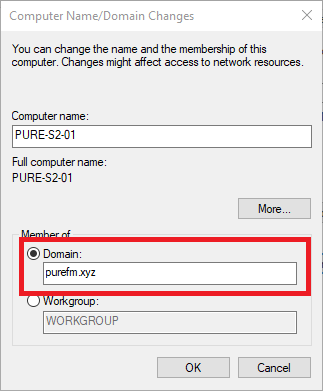
8. When prompted for a username and password, enter either your Domain Super Admin account, or contact the Technical Director for assistance
9. Once authenticated, it may take a second to join the domain, and then a window saying "Welcome to the purefm.xyz domain"  
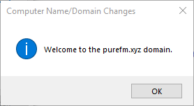
10. Click "OK" on this window and reboot the computer

{: .note}
The computer should now be fully setup and connected to the domain. When the computer has restarted, try logging in with your account. It may take a while for the first log in. If it doesn't work, contact the Technical Director