# New User Account

This guide will take you through how to create a new user account on Active Directory('AD').

## You Will Need
1. An account on PureNet with Domain Administrator rights to Active Directory
2. Remote desktop access to our AD Server

## Part I: Creating A User
1. From a computer connected to PureNet, open 'Remote Desktop Connection' and enter the computer name `JORDANNORTH`  
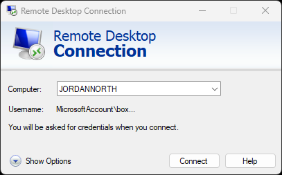
1. Enter your Domain Administrator credentials when prompted. You will need to enter the domain name, this is done by putting `PUREFM\` before your username.
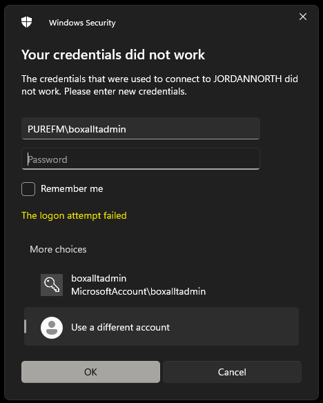
1. Once you've connected, you'll see a Windows desktop come up. Windows Server Manager will also open. You may see some *errors*, this is the Clipboard Service not loading. We can live without it, so minimise Server Manager and open the start menu.
1. In the start menu, search for `Active Directory Users and Computers`
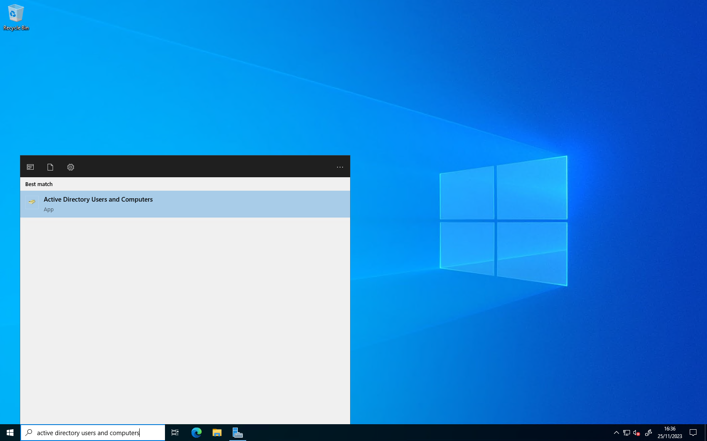
1. Open Active Directory Users and Computers. The view you are presented with will be the last view you had open. In the menu on the left hand side, select `Domain Users` (you may need to expand `purefm.xyz`).
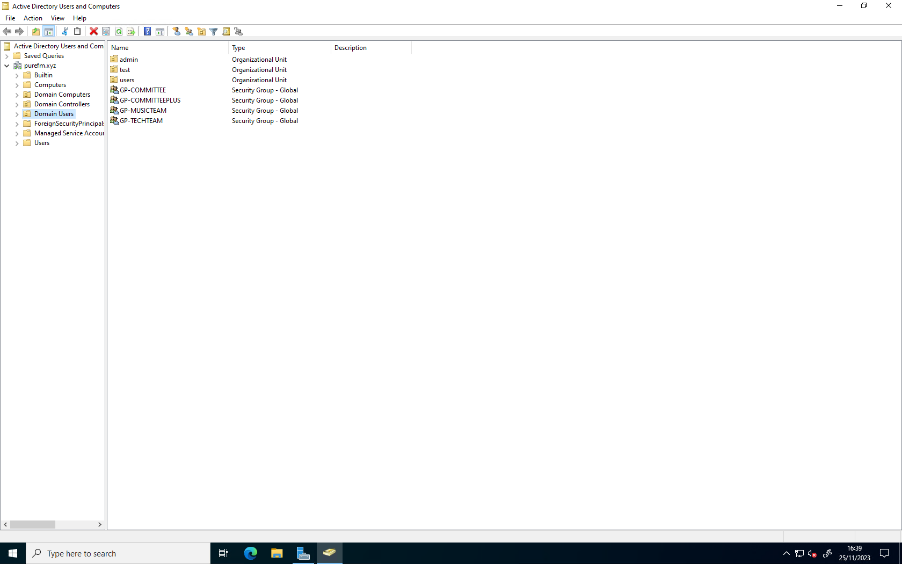
1. In the main window on the right, double click on `users` (this is opening the `users` Organisational Unit (OU)). If you're creating an admin account - open the `admin` OU instead.
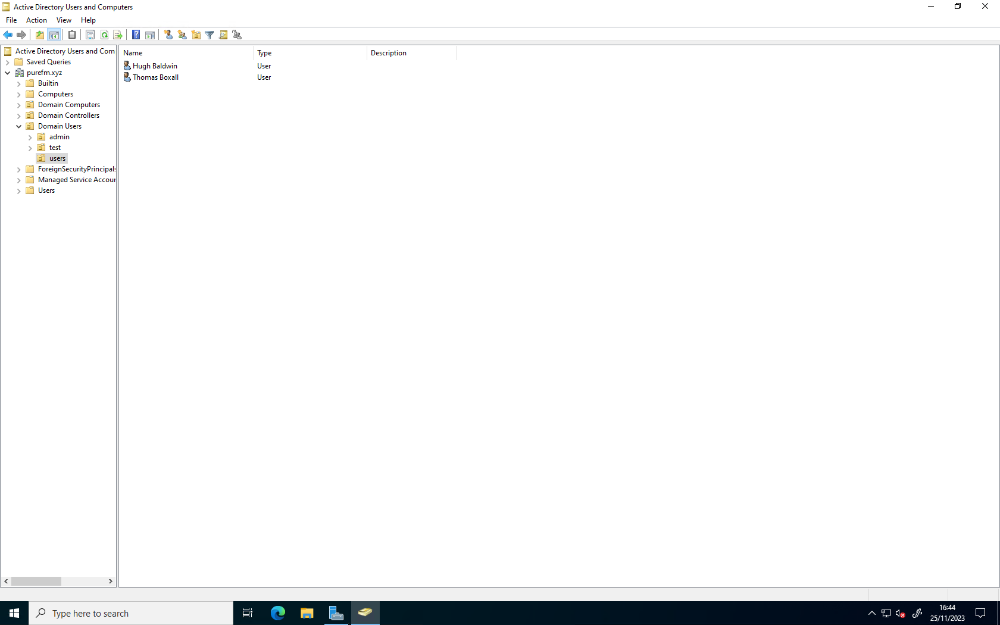
1. Select the `Create new user in current container` button

1. Enter the new users first name and last name. Then set their 'User logon name' to be the first initial of their first name followed by their surname. If they have multiple surnames, or a double-barrelled surname, use a hyphen (`-`) between their surnames. (For example: `Joe Bloggs` would have the username `jbloggs`, or `Fred Freaser-Corbridge` would be `ffreaser-corbridge`.) The User logon name (pre-Windows 2000) should auto-populate with the user logon name you've just set. Then press `Next`
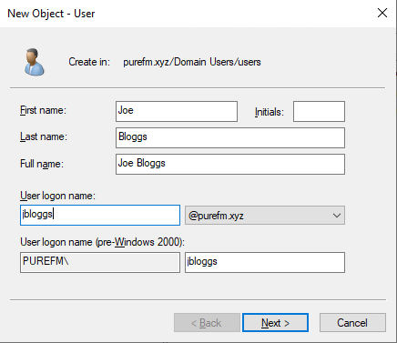
1. The next screen will ask you to set a password for the user. Enter a temporary password of your choosing (remember to remember it as you'll have to tell it to the user in a minute), then press Next. Ensure that the checkboxes are set the same as they are in the photo:
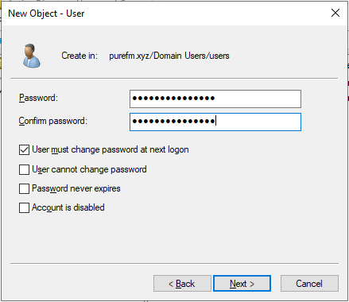
1.  Confirm the settings are correct and then press Finish.
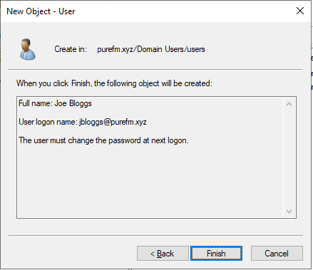
## Part II: Adding User To Security Groups
1.  If the account creation has been successful, the user will now be listed in the users list. Right click on the user and select 'Properties'.
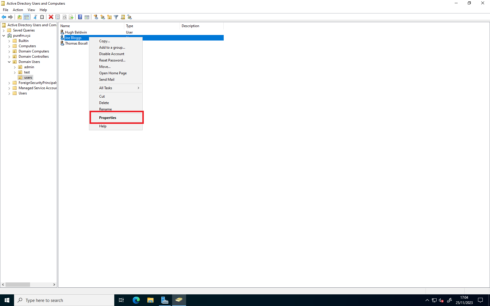
1.  When the window opens, open the 'Member Of' tab, this may be in a different place as once you click on a tab - they move. Then click the 'Add button'

1.  Within the 'Select Groups' dialogue which comes up, enter the name of the group in the big box then press 'Check Names'. Active Directory will either throw a fit and tell you it doesn't recognise the names of the group or it will underline the group name, indicating it has found it. What groups to add someone to depends on their role. (Further information about groups will be added once we've finished testing them to make sure they work properly!) Then click 'OK' and you will see the groups listed in the user properties window.
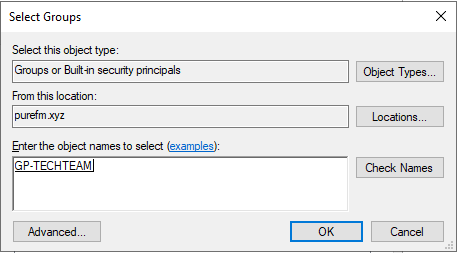
1.  Click 'Apply' then 'OK'. 
## Part III: Creating Home Folder
Now we have to create a folder to act as that user's home folder. This has to be done manually, as Active Directory can't do things like this itself. 
1.  Open the `V` Drive (where Admin's can access user's files)
2.  Right-click and create a new folder. Set it's name to the username of the user.
3.  Right click on this, select Properties, then click into the Security Tab. Then click Edit.
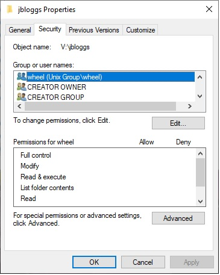
4. Click Add
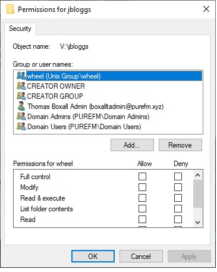
5. Enter their username then click *Check Names* then click *OK*. AD will throw a wobbly if their username doesn't exist.
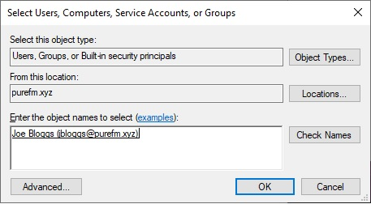
6. In the list of users - select their name then check the Modify box in the Allow column.

7. Click Apply, then OK (to close the Edit Window) then OK (to close the Folder Properties window)

{: .note}
Congratulations! You've successfully created a user in Active Directory. You can now close the Active Directory users and Computers software and log out of the server. DO NOT SHUT DOWN THE SERVER WITHOUT EXPLICIT PERMISSION FROM THE TECHNICAL DIRECTOR. 